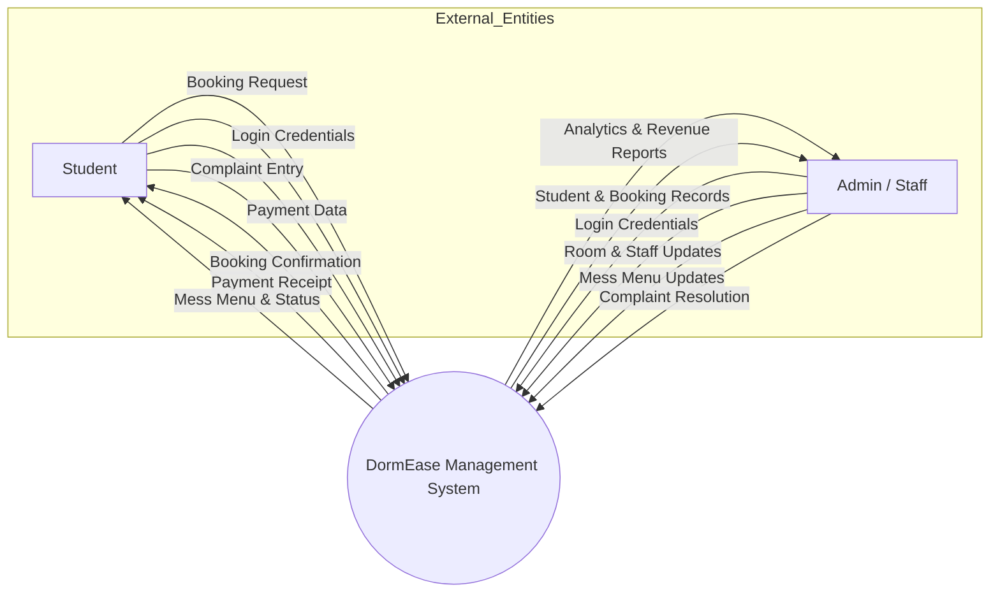
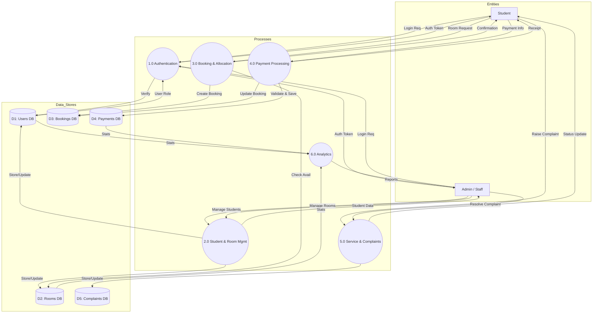

# DormEase Management System - Data Flow Diagrams

This document contains the Data Flow Diagrams (DFD) for the DormEase dormitory management system.

## DFD Level 0 (Context Diagram)

The Context Diagram shows the system as a single process interacting with external entities (Student and Admin).

---

## DFD Level 1 (Process Breakdown)

DFD Level 1 breaks down the main system into detailed sub-processes and data stores.

> [!NOTE]
> These diagrams represent the core data flow of the DormEase system based on the current implementation of routes and models in the backend.
