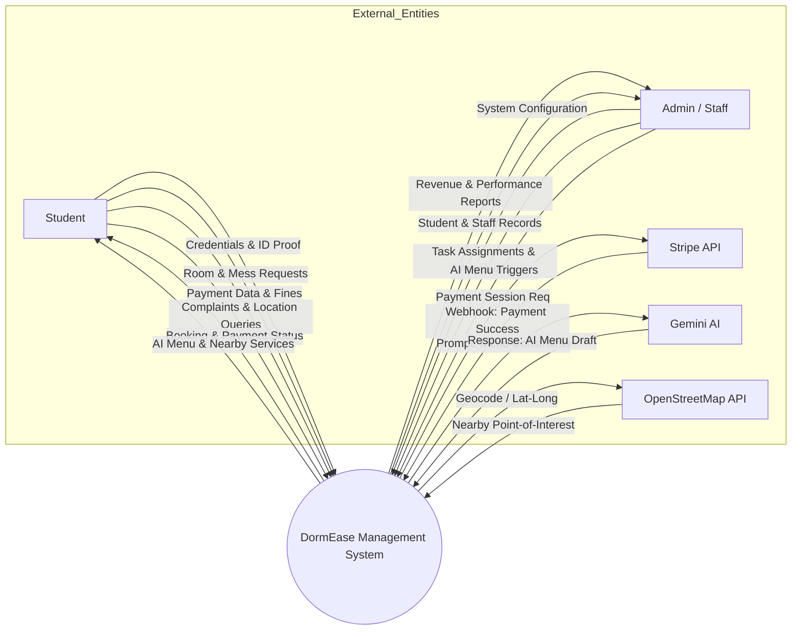
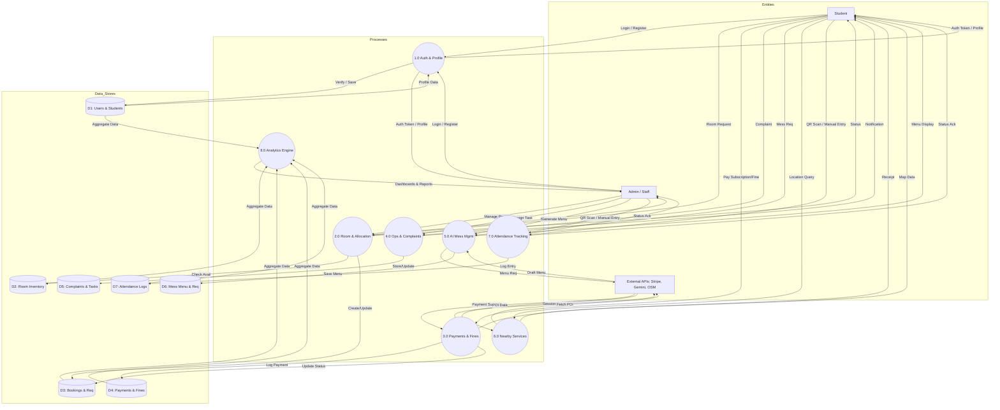
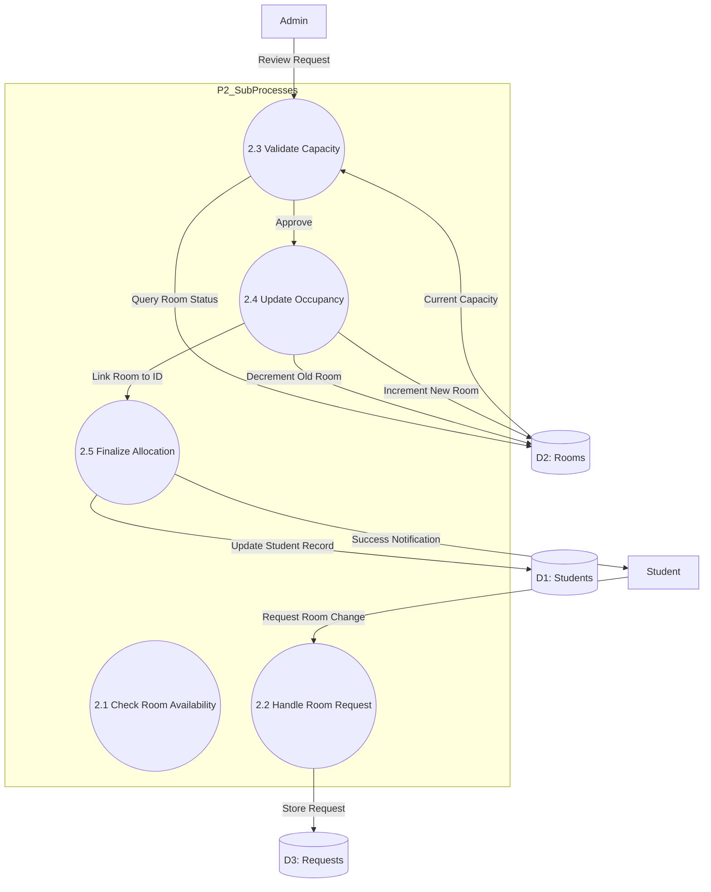
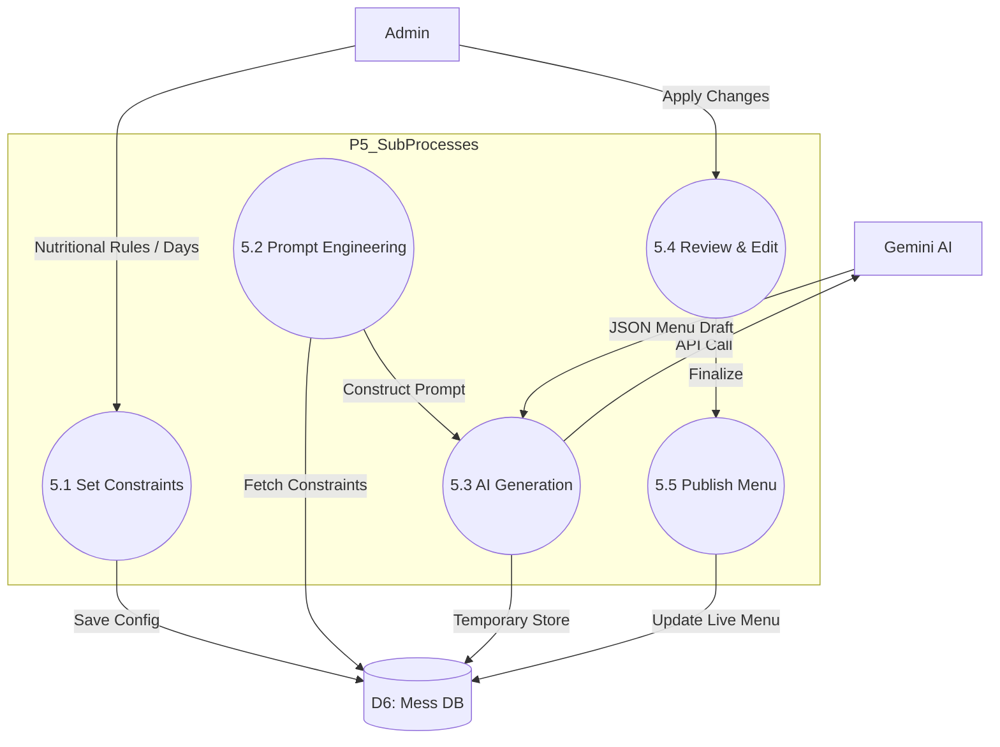

# DormEase Management System - Data Flow Diagrams

This document contains the detailed Data Flow Diagrams (DFD) for the DormEase dormitory management system.

## DFD Level 0 (Context Diagram)

The Context Diagram shows the system as a single process interacting with external entities.

```mermaid
graph LR
    subgraph External_Entities
        Student[Student]
        Admin[Admin / Staff]
        Stripe[Stripe API]
        Gemini[Gemini AI]
        OSM[OpenStreetMap API]
    end

    System((DormEase Management System))

    %% Student Data Flows
    Student -- "Credentials & ID Proof" --> System
    Student -- "Room & Mess Requests" --> System
    Student -- "Payment Data & Fines" --> System
    Student -- "Complaints & Location Queries" --> System
    System -- "Booking & Payment Status" --> Student
    System -- "AI Menu & Nearby Services" --> Student

    %% Admin Data Flows
    Admin -- "System Configuration" --> System
    Admin -- "Task Assignments & Approvals" --> System
    Admin -- "AI Menu Triggers" --> System
    System -- "Revenue & Performance Reports" --> Admin
    System -- "Student & Staff Records" --> Admin

    %% External APIs
    System -- "Payment Session Req" --> Stripe
    Stripe -- "Webhook: Payment Success" --> System
    System -- "Prompt: Menu Constraints" --> Gemini
    Gemini -- "Response: AI Menu Draft" --> System
    System -- "Geocode / Lat-Long" --> OSM
    OSM -- "Nearby Point-of-Interest" --> System
```

---

## DFD Level 1 (Process Breakdown)

DFD Level 1 breaks down the main system into detailed functional processes and core data stores.

```mermaid
graph TD
    subgraph Entities
        S[Student]
        A[Admin / Staff]
        E_API[External APIs: Stripe, Gemini, OSM]
    end

    subgraph Processes
        P1((1.0 Auth & Profile))
        P2((2.0 Room & Allocation))
        P3((3.0 Payments & Fines))
        P4((4.0 Ops & Complaints))
        P5((5.0 AI Mess Mgmt))
        P6((6.0 Nearby Services))
        P7((7.0 Attendance Tracking))
        P8((8.0 Analytics Engine))
    end

    subgraph Data_Stores
        D1[(D1: Users & Students)]
        D2[(D2: Room Inventory)]
        D3[(D3: Bookings & Req)]
        D4[(D4: Payments & Fines)]
        D5[(D5: Complaints & Tasks)]
        D6[(D6: Mess Menu & Req)]
        D7[(D7: Attendance Logs)]
    end

    %% Process 1.0: Auth
    S & A -- "Login / Register" --> P1
    P1 -- "Verify / Save" --> D1
    D1 -- "Profile Data" --> P1
    P1 -- "Auth Token / Profile" --> S & A

    %% Process 2.0: Room Mgmt
    A -- "Manage Rooms" --> P2
    S -- "Room Request" --> P2
    P2 -- "Check Avail" --> D2
    P2 -- "Create/Update" --> D3
    P2 -- "Status" --> S & A

    %% Process 3.0: Payments
    S -- "Pay Subscription/Fine" --> P3
    P3 -- "Session Create" --> E_API
    E_API -- "Payment Success" --> P3
    P3 -- "Log Payment" --> D4
    P3 -- "Update Status" --> D3
    P3 -- "Receipt" --> S

    %% Process 4.0: Operations
    S -- "Complaint" --> P4
    A -- "Assign Task" --> P4
    P4 -- "Store/Update" --> D5
    P4 -- "Notification" --> S

    %% Process 5.0: AI Mess
    A -- "Generate Menu" --> P5
    S -- "Mess Req" --> P5
    P5 -- "Menu Req" --> E_API
    E_API -- "Draft Menu" --> P5
    P5 -- "Save Menu" --> D6
    P5 -- "Menu Display" --> S

    %% Process 6.0: Nearby Services
    S -- "Location Query" --> P6
    P6 -- "Fetch POI" --> E_API
    E_API -- "POI Data" --> P6
    P6 -- "Map Data" --> S

    %% Process 7.0: Attendance
    S & A -- "QR Scan / Manual Entry" --> P7
    P7 -- "Log Entry" --> D7
    P7 -- "Status Ack" --> S & A

    %% Process 8.0: Analytics
    D1 & D2 & D3 & D4 & D7 -- "Aggregate Data" --> P8
    P8 -- "Dashboards & Reports" --> A
```

---

## DFD Level 2 (Detailed Processes)

### Process 2.0: Room & Allocation Management

This diagram explodes Process 2.0 to show the internal flow of room requests and capacity updates.

```mermaid
graph TD
    S[Student]
    A[Admin]
    
    subgraph P2_SubProcesses
        P2_1((2.1 Check Room Availability))
        P2_2((2.2 Handle Room Request))
        P2_3((2.3 Validate Capacity))
        P2_4((2.4 Update Occupancy))
        P2_5((2.5 Finalize Allocation))
    end
    
    D2[(D2: Rooms)]
    D3[(D3: Requests)]
    D1[(D1: Students)]

    S -- "Request Room Change" --> P2_2
    P2_2 -- "Store Request" --> D3
    A -- "Review Request" --> P2_3
    P2_3 -- "Query Room Status" --> D2
    D2 -- "Current Capacity" --> P2_3
    
    P2_3 -- "Approve" --> P2_4
    P2_4 -- "Decrement Old Room" --> D2
    P2_4 -- "Increment New Room" --> D2
    
    P2_4 -- "Link Room to ID" --> P2_5
    P2_5 -- "Update Student Record" --> D1
    P2_5 -- "Success Notification" --> S
```

### Process 5.0: AI Mess Management

Explosion of the AI-driven mess menu generation workflow.

```mermaid
graph TD
    A[Admin]
    E_Gemini[Gemini AI]
    
    subgraph P5_SubProcesses
        P5_1((5.1 Set Constraints))
        P5_2((5.2 Prompt Engineering))
        P5_3((5.3 AI Generation))
        P5_4((5.4 Review & Edit))
        P5_5((5.5 Publish Menu))
    end
    
    D6[(D6: Mess DB)]

    A -- "Nutritional Rules / Days" --> P5_1
    P5_1 -- "Save Config" --> D6
    
    P5_2 -- "Fetch Constraints" --> D6
    P5_2 -- "Construct Prompt" --> P5_3
    
    P5_3 -- "API Call" --> E_Gemini
    E_Gemini -- "JSON Menu Draft" --> P5_3
    
    P5_3 -- "Temporary Store" --> D6
    A -- "Apply Changes" --> P5_4
    P5_4 -- "Finalize" --> P5_5
    P5_5 -- "Update Live Menu" --> D6
```

> [!NOTE]
> Process 5.0 utilizes Gemini Flash 2.5 for dynamic menu generation.
> Process 3.0 integrates Stripe Checkout for secure financial transactions.
> Process 7.0 supports both automated QR scanning and manual administrative overrides for attendance.
